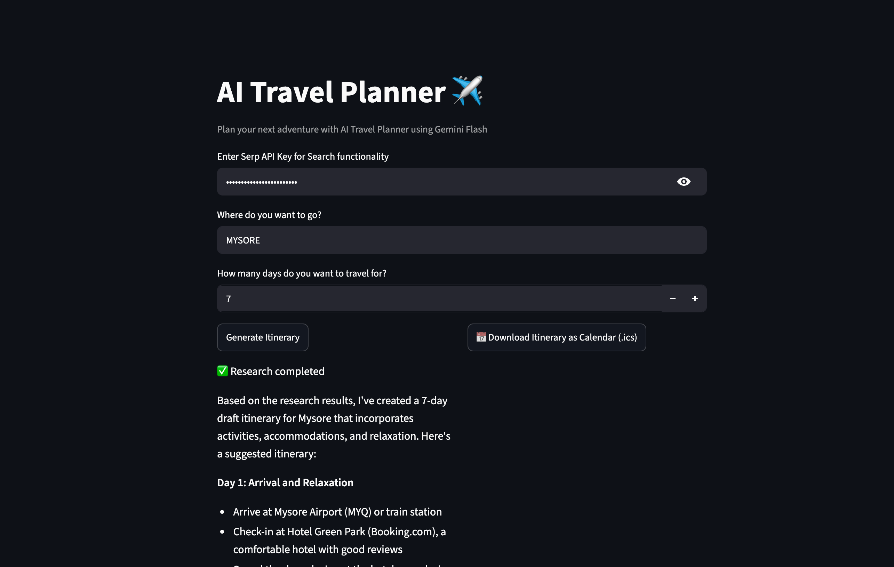

# ✈️ AI Travel Planner

An AI-powered travel planning agent that researches destinations and generates personalized itineraries — running 100% free using local Ollama models.

Built as part of my learning journey with the [awesome-llm-apps](https://github.com/Shubhamsaboo/awesome-llm-apps) repo.

---

## 🤖 How It Works

This app uses **two AI agents working together**:

- **Researcher Agent** — searches the web for activities, places, and accommodations at your destination
- **Planner Agent** — takes the research and creates a detailed day-by-day itinerary

> This is a real multi-agent system — not just a single chatbot!

---

## 🛠️ Tech Stack

- [Agno](https://github.com/agno-agi/agno) — AI agent framework
- [Ollama](https://ollama.com) — Run open-source LLMs locally (free, no API key needed)
- [Llama 3.2](https://ollama.com/library/llama3.2) — The local AI model
- [SerpAPI](https://serpapi.com) — Web search for the research agent
- [Streamlit](https://streamlit.io) — Web UI

---

## 🚀 Getting Started

### Prerequisites
- Python 3.8+
- [Ollama](https://ollama.com) installed
- [SerpAPI](https://serpapi.com) free API key (100 searches/month)

### Installation

```bash
# Clone the repo
git clone https://github.com/sagarsrao/ai-travel-agent.git
cd ai-travel-agent

# Create and activate virtual environment
python3 -m venv venv
source venv/bin/activate  # On Windows: venv\Scripts\activate

# Install dependencies
pip install -r requirements.txt
```

### Run Ollama

```bash
# Pull the model
ollama pull llama3.2

# Start the server (keep this terminal open)
ollama serve
```

### Run the App

```bash
streamlit run travel_agent.py
```

Open your browser at `http://localhost:8501`, enter your SerpAPI key, and start planning! 🗺️

---

## 📸 Demo

> 

---

## 🙏 Credits

- Original project from [awesome-llm-apps](https://github.com/Shubhamsaboo/awesome-llm-apps) by Shubham Saboo
- Modified to use Ollama local models instead of OpenAI/Gemini

---

## 📚 What I Learned

- Setting up Python virtual environments
- How multi-agent AI systems work
- Swapping AI models in real code
- Debugging errors like a developer
